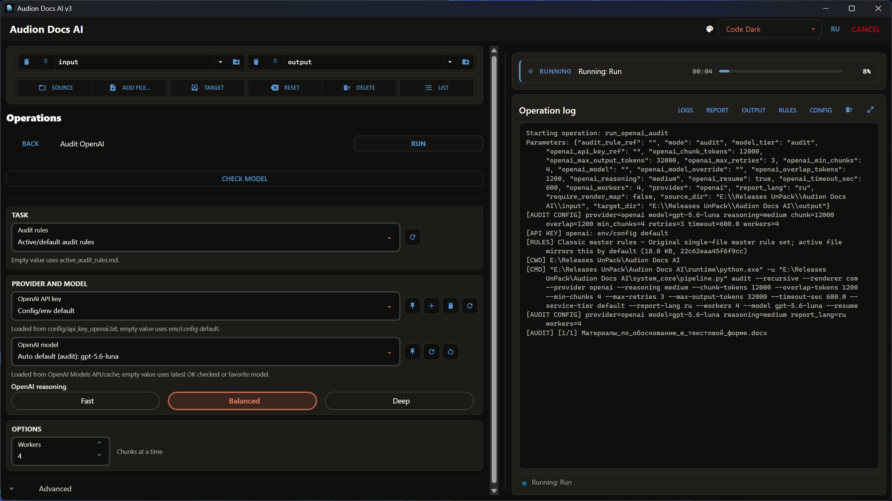

# Audion Docs AI v3

<!-- audion:release -->
[](https://audion.dev/downloads/docs-ai) [](https://github.com/Tensionix/docs-ai/releases/latest) [](https://github.com/Tensionix/docs-ai/releases) [](https://github.com/Tensionix/docs-ai/blob/main/LICENSE)

**Version 1.9.3** · 2026-08-25 · 505.6 MB

- [Direct download](https://audion.dev/get/docs-ai/1.9.3/Audion_Docs_AI_v1.9.3_Full.zip) — unmetered, no rate limits
- [Project page](https://audion.dev/downloads/docs-ai) — every version and how to install



`SHA-256: 5432c2a1cdbfdc96592b3e2078874482786d6beccc108d6bc82d18c93bd67a22`

---

An **Audion** tool, published by [Tensionix](https://github.com/Tensionix).
<!-- /audion:release -->

Audion Docs AI v3 is a portable, Windows-first pipeline for document extraction, LLM audit, local DOCX normalization from existing audit JSON, structured reporting, and optional DOCX review anchors.


```text

Scan DOCX/PPTX -> COM PDF/render-map export -> Audit -> Report -> Normalize / Annotate

```


The project is designed for real Windows document workflows: DOCX/PPTX rendering through Microsoft Office COM, repeatable LLM chunking, resumable audits, and launcher-driven operation from a portable Python runtime.


## Current State


The current project no longer has separate legacy audit launchers for provider pairs. OpenAI, Gemini, xAI, and Anthropic Claude are selected in the GUI; chunk sizes, retry limits, and prompt file names live in `config\llm_settings.yaml`. Application defaults are `gpt-5.6-luna`, `gemini-3.6-flash`, `grok-4.3`, and `claude-sonnet-5`; an explicit GUI selection or manual override wins. GUI lists, cache/favorites, and explicit smoke checks remain local.


The visible Project launcher workflow is now DOCX/PPTX-first. It starts from `input\` and uses the recursive pipeline directly; the old Markdown extraction actions are not shown in the Project menu.


Root launchers:


- `builder_main.cmd` - build, install, verify, release, and open project/tools launchers

- `launcher_gui.cmd` - desktop GUI shell over the recursive pipeline

- `launcher_project.cmd` - English project workflow, sets `AUDION_REPORT_LANG=en`

- `launcher_project_ru.cmd` - Russian project workflow, sets `AUDION_REPORT_LANG=ru`

- `launcher_tools.cmd` - service tools, license maintenance, GitHub cleanup

- `cleanup_project.cmd` - remove local runtime/dependencies/generated data before publishing source code


## GUI Shell


Launch the GUI with:


```bat

launcher_gui.cmd

```


The GUI does not replace the CLI. It wraps `system_core\pipeline.py`, `system_core\document_normalizer.py`, and `system_core\doc_task_runner.py`: commands and runtime parameters stay on the left, while status and live terminal output stay on the right. OpenAI, Gemini, xAI, and Claude audit screens group API key and model selection together, keep audit rules below, and expose a single `Run` action: the audit command builds or reuses render artifacts, calls the LLM, validates the report language, and only then writes XLSX/DOCX reports and annotated copies. Separate root correction commands for OpenAI, Gemini, xAI, and Claude do not call the LLM again: they read existing `logs\**\*__audit.json` files and apply only `fix_mode: safe_replace`, `confidence: high`, exact single-occurrence `old_text -> new_text` replacements to DOCX copies. TASK commands read DOCX/PPTX/XLSX/PDF; PDF is used as read-only text pages for extraction reports, not editing. Each audit provider has compact depth radio buttons: OpenAI sends reasoning effort, Gemini 3 sends a real `thinking_level`, xAI sends a real `reasoning_effort`, and Claude sends an `effort` level with adaptive thinking always on. Secondary values live in a collapsible `Advanced` block. Python is launched unbuffered, so the effective configuration and every chunk's progress appear immediately. Model lists and selected-model smoke status are cached locally; empty fallback uses the latest OK checked model, then the first favorite model, never an arbitrary raw provider-list item.


The model `Refresh model names` button makes a live provider API request with the currently selected key for that provider; `RESET` clears that provider's local model cache. LLM audit and TASK resume/cache entries are signed with the source document hash and key run parameters, so an edited file with the same name should not reuse an old LLM response.


## Canonical Workbench labels


Workbench buttons are `Source`, `Add file...`, `Target`, `Reset`, `Delete`, `List` (RU: `Источник`, `Добавить файл...`, `Назначение`, `Сбросить`, `Удалить`, `Список`). The selected folder or single document is passed directly to the backend. `Reset` restores project `input\`/`output\` without deleting files; `Delete` clears the selected Source/Target only after confirmation.


GUI-only settings:


- `config\gui_settings.yaml`

- `config\tool_manifest.yaml`


Internal workflow documentation:


- `docs\GUI_WORKFLOW_RU.md`

- `docs\DOCUMENT_NORMALIZATION_RU.md`

- `docs\GITHUB_PREP_RU.md`


## Main Workflow


### Recursive DOCX/PPTX Pipeline


The newer recursive pipeline lives in `system_core\pipeline.py`.


It reads only from:


```text

input\

```


It writes:


- user-facing files to `output\`

- JSON logs/maps to `logs\`

- intermediate render artifacts to `work\`


Main commands:


```bat

runtime\python.exe system_core\pipeline.py scan

runtime\python.exe system_core\pipeline.py render --recursive --renderer com

runtime\python.exe system_core\pipeline.py audit --recursive --renderer com

runtime\python.exe system_core\pipeline.py audit --recursive --renderer com --require-render-map

runtime\python.exe system_core\pipeline.py report --from-logs logs --report-lang en

runtime\python.exe system_core\pipeline.py annotate --from-logs logs

runtime\python.exe system_core\document_normalizer.py --provider openai --from-logs logs

runtime\python.exe system_core\document_normalizer.py --provider gemini --from-logs logs

```


The COM renderer creates marked OOXML copies, exports them through Microsoft Office, extracts PDF text with PyMuPDF, and builds render maps. In strict mode the pipeline fails if the render map cannot be produced instead of inventing page locations.


Visible Project launcher actions:


- `SCAN input`

- `COM PDF EXPORT / RENDER MAP`

- `AUDIT COM`

- `AUDIT COM STRICT`

- `REPORT FROM LOGS`

- `ANNOTATE FROM LOGS`

- `NORMALIZE OPENAI`

- `NORMALIZE GEMINI`

- `RUN ALL COM WORKFLOW`

- OpenAI audit group

- Gemini audit group

- open `input`, `output`, `logs`, `work`, `config`


### Audit-Based Document Normalization


Normalization is a separate local step after audit. It reads ready

`logs\**\*__audit.json` files, filters records by `meta.provider`, and creates

normalized DOCX copies:


```text

output\<relative_path>\<stem>__normalized.docx

```


Only explicit safe exact replacements from the audit JSON are applied:

`fix_mode: safe_replace`, `confidence: high`, `block_id`, `old_text`, and

`new_text`. Older or ambiguous rows are preserved in the `Unresolved Items`

table of the normalization report. Reports are written to

`output\_normalization\`; patch plans are written to

`report\document_normalization\`.


## Configuration


All project-level LLM settings live in:


```text

config\llm_settings.yaml

```


The YAML defines application defaults: OpenAI `gpt-5.6-luna`, Gemini `gemini-3.6-flash`, xAI `grok-4.3`, and Anthropic `claude-sonnet-5`. GUI model dropdowns, favorites, and selected-model smoke statuses live in `config\gui_model_cache.json`; an explicit GUI selection or manual override takes precedence.


The launcher reads this file through:


```text

system_core\config_resolver.py

```


Prompt files live in `config\` as Markdown:


- `audit_system_prompt.md`

- `audit_user_prompt.md`

- `ocr_prompt.md`

- `resolver.md`


The audit prompt asks the model to mark only unambiguous exact replacements as

`safe_replace`; ambiguous items remain `requires_review` and are not applied

automatically.


With `report_lang=ru`, the prompt requires Russian human-readable fields. English-only or English-dominant `problem` and `recommendation` values receive a short repair call to the same provider. On failure, one cross-provider fallback is allowed: OpenAI/xAI → `gemini-3.6-flash` (`minimal`), Gemini/Anthropic → `gpt-5.6-luna` (`low`). Completed audit chunks are never repeated. Both attempts, diagnostics, and an exact-input cache are stored in `logs\<stem>__language_repair.json`; a double failure blocks XLSX/DOCX publication.


Audit rule files live in `config\audit_rules\`. The active file for CLI/TUI and default GUI runs is:


- `config\audit_rules\active_audit_rules.md`


General LLM document task instructions live in `config\doc_tasks\`. The active task instruction is:


- `config\doc_tasks\active_doc_task.md`


For one-off requests, the GUI can pass an inline instruction without a Markdown file. Reusable quick instructions are cached and added to favorites in:


- `config\gui_doc_task_quick_cache.json`


The document task runner reads DOCX/PPTX/XLSX/PDF recursively from `input\`. PDF is read through PyMuPDF as read-only text pages; by default only the first 5 pages are used. In auto mode, multi-file extraction and matching tasks run as one corpus; exact replacements stay per file and are applied only to DOCX copies in `output\`.


The primary human-facing result is DOCX, styled like the audit report. Matching/extraction tables are written to XLSX with the same warm table styling as audit workbooks; JSON `values` returned by the model become real columns.


For repeatable requisites tables, TASK can also create clean exports from a DOCX/XLSX template stored in `input\`: the selected template is not sent to the model as a data source, its first row defines exact output columns, and its second row gives value-format hints. Extra clean outputs are written to `output\_doc_tasks\` as `*__doc_task_clean.json`, `*__doc_task_clean.xlsx`, and, for DOCX templates, `*__doc_task_clean.docx`.


API key placeholders live in:


- `config\api_key_openai.txt`

- `config\api_key_gemini.txt`

- `config\api_key_xai.txt`

- `config\api_key_anthropic.txt`


Environment variables are also supported:


- `OPENAI_API_KEY`

- `GEMINI_API_KEY`

- `XAI_API_KEY`

- `ANTHROPIC_API_KEY`


Do not commit real keys.


## Repository Layout


```text

config/                  LLM settings, key placeholders, prompt/rules/task Markdown

install/                 build, install, verify, release scripts

system_core/             engines, pipeline, renderers, helpers

tests/                   unit tests


input/                   recursive DOCX/PPTX audit input and DOCX/PPTX/XLSX/PDF document-task input

output/                  user-facing reports and annotated/fixed files

logs/                    JSON logs, block maps, render maps, audit logs

report/                  supporting reports and normalization patch plans

work/                    rendered PDFs, marked OOXML, extracted PDF text

cache/                   pipeline cache


runtime/                 generated portable Python runtime, not source

wheelhouse/              generated local wheel cache, not source

system_core/powershell/  optional generated portable PowerShell, not source

licenses/                generated third-party notices

release/                 generated release archives

._runtime/               launcher temp files

```


## Build And Verify


Use the build launcher:


```bat

builder_main.cmd

```


It owns:


- portable runtime build

- offline install

- environment verification

- `fzf.exe` update

- release archive creation

- opening runtime/wheelhouse/release/license folders

- launching Project EN/RU and Tools


Direct verification:


```bat

runtime\python.exe -m compileall system_core tests

runtime\python.exe -m unittest discover -s tests

install\verify_portable_env.cmd

```


Microsoft Office COM export can fail in restricted or non-interactive sessions with `0x80070520`. For real render validation, run from a normal interactive Windows PowerShell or VS Code terminal.


## Tools


Use:


```bat

launcher_tools.cmd

```


Tools owns service tasks:


- collect third-party licenses

- collect and deduplicate licenses

- prune stale license folders

- prepare the tree for GitHub

- open config/logs/work/output folders


## Preparing For GitHub


Run:


```bat

cleanup_project.cmd

```


It removes local generated/runtime state:


- `runtime\`

- `wheelhouse\`

- `.venv*`

- `system_core\powershell\`

- `system_core\fzf.exe`

- caches, outputs, logs, work artifacts

- release/license generated folders

- old audit launchers and root API key leftovers


It keeps source files, GitHub documentation, install scripts, tests, configs, and recreates a minimal empty folder structure. Root-level API-key leftovers are removed; `config\api_key_openai.txt`, `config\api_key_gemini.txt`, `config\api_key_xai.txt`, and `config\api_key_anthropic.txt` must be checked and sanitized manually before publishing so real keys are not published.


## Security


Documents may be sent to external LLM providers. Process only documents you are allowed to transmit to the selected provider.


Never commit:


- real API keys

- private source documents

- generated logs containing sensitive content

- generated reports that contain private document text

- local `backup_before_*` folders, QA render directories, PID files, and Python/test caches

